# ML System Design Tutorial Series - Comprehensive Structure Plan

## Overview

This document outlines a comprehensive tutorial series based on the "Machine Learning System Design Interview" framework. The series follows a 7-step framework for designing production-ready ML systems, with hands-on coding examples for each major concept.

---

## Tutorial Series Architecture

```mermaid
flowchart TD
    subgraph Foundation[Module 0: Foundation]
        M00[00 - Introduction to ML Systems]
    end
    
    subgraph Step1[Module 1: Requirements]
        M01[01 - Clarifying Requirements]
    end
    
    subgraph Step2[Module 2: Problem Framing]
        M02[02 - Framing ML Problems]
        M03[03 - ML Categories Deep Dive]
    end
    
    subgraph Step3[Module 3: Data Preparation]
        M04[04 - Data Engineering Fundamentals]
        M05[05 - ETL Pipelines]
        M06[06 - Feature Engineering Operations]
        M07[07 - Feature Engineering for Unstructured Data]
    end
    
    subgraph Step4[Module 4: Model Development]
        M08[08 - Model Selection Strategies]
        M09[09 - Dataset Construction]
        M10[10 - Loss Functions and Training]
        M11[11 - Distributed Training]
    end
    
    subgraph Step5[Module 5: Evaluation]
        M12[12 - Offline Evaluation Metrics]
        M13[13 - Online Evaluation and A/B Testing]
    end
    
    subgraph Step6[Module 6: Deployment]
        M14[14 - Deployment Strategies]
        M15[15 - Model Compression Techniques]
        M16[16 - Serving Infrastructure]
    end
    
    subgraph Step7[Module 7: Monitoring]
        M17[17 - Monitoring and Drift Detection]
        M18[18 - ML Infrastructure]
    end
    
    subgraph CaseStudies[Module 8: Case Studies]
        M19[19 - Recommendation System Design]
        M20[20 - Content Moderation System]
        M21[21 - Search Ranking System]
    end
    
    Foundation --> Step1 --> Step2 --> Step3 --> Step4 --> Step5 --> Step6 --> Step7 --> CaseStudies
```



---

## Detailed Tutorial Specifications

### Module 0: Foundation

#### Tutorial 00: Introduction to ML Systems
**Filename:** `00_introduction_to_ml_systems.ipynb`

**Learning Objectives:**
- Understand the difference between ML algorithms and ML systems
- Identify components of production-ready ML systems
- Learn the 7-step ML system design framework

**Topics Covered:**
1. ML Algorithms vs ML Systems
2. Components of Production ML Systems
   - Data stack
   - Serving infrastructure
   - Evaluation pipeline
   - Monitoring systems
3. The 7-Step Framework Overview
4. When to Use ML vs Traditional Approaches

**Code Examples:**
```python
# Example: Simple ML system architecture visualization
# Example: Comparison of ML pipeline stages
# Example: Decision framework for ML applicability
```

**Hands-on Exercise:**
- Analyze a simple recommendation system architecture
- Map components to the 7-step framework

---

### Module 1: Clarifying Requirements

#### Tutorial 01: Clarifying Requirements for ML Systems
**Filename:** `01_clarifying_requirements.ipynb`

**Learning Objectives:**
- Master the art of asking clarifying questions
- Translate business objectives to technical requirements
- Document system constraints and scale requirements

**Topics Covered:**
1. Business Objective Questions
   - Revenue vs engagement optimization
   - User retention goals
2. Feature Requirements
   - User interactions (likes, dislikes, ratings)
   - Content types supported
3. Data Questions
   - Data sources and availability
   - Data labeling status
   - Data size and growth rate
4. Constraint Questions
   - Cloud vs on-device
   - Latency requirements
   - Accuracy vs speed trade-offs
5. Scale Questions
   - Number of users
   - Number of items
   - Request throughput
6. Performance Questions
   - Real-time vs batch
   - Accuracy priorities

**Code Examples:**
```python
# Template: Requirements documentation class
# Example: Requirements checklist generator
# Example: Scale calculator for different scenarios
```

**Hands-on Exercise:**
- Given a scenario (e.g., "Design a video recommendation system"), practice asking clarifying questions
- Document requirements in a structured format

---

### Module 2: Problem Framing

#### Tutorial 02: Framing Problems as ML Tasks
**Filename:** `02_framing_ml_problems.ipynb`

**Learning Objectives:**
- Translate business objectives to ML objectives
- Define appropriate input/output specifications
- Choose between single and multi-model architectures

**Topics Covered:**
1. Business to ML Objective Translation
   - Examples: ticket sales → event registrations
   - Examples: user engagement → watch time maximization
2. Defining System Input/Output
   - Single model designs
   - Multi-model system designs
   - Input-output specification patterns
3. Model Architecture Decisions
   - Monolithic vs modular approaches
   - Pipeline architectures

**Code Examples:**
```python
# Example: Objective mapping function
# Example: Input-output schema definitions
# Example: Multi-model pipeline design pattern
```

**Hands-on Exercise:**
- Frame 3 different business problems as ML tasks
- Design input/output specifications for each

---

#### Tutorial 03: ML Categories Deep Dive
**Filename:** `03_ml_categories_deep_dive.ipynb`

**Learning Objectives:**
- Understand supervised, unsupervised, and reinforcement learning paradigms
- Distinguish between classification, regression, and ranking tasks
- Make informed decisions about ML category selection

**Topics Covered:**
1. Supervised Learning
   - Binary classification
   - Multi-class classification
   - Multi-label classification
   - Regression
   - Ranking
2. Unsupervised Learning
   - Clustering
   - Dimensionality reduction
   - Anomaly detection
3. Reinforcement Learning
   - When to use RL
   - Practical applications
4. Decision Framework
   - Choosing the right category
   - Trade-offs and considerations

**Code Examples:**
```python
# Example: Binary classifier for spam detection
# Example: Multi-class classifier for sentiment analysis
# Example: Regression model for price prediction
# Example: Clustering for customer segmentation
```

**Hands-on Exercise:**
- Implement a mini-project that demonstrates each ML category
- Compare performance characteristics

---

### Module 3: Data Preparation

#### Tutorial 04: Data Engineering Fundamentals
**Filename:** `04_data_engineering_fundamentals.ipynb`

**Learning Objectives:**
- Understand different data sources and their characteristics
- Learn about various database types and their use cases
- Distinguish between structured and unstructured data

**Topics Covered:**
1. Data Sources
   - User-generated vs system-generated data
   - First-party vs third-party data
   - Real-time vs batch data
2. Data Storage Types
   - Relational databases (RDBMS)
   - NoSQL databases (Document, Key-Value, Column, Graph)
   - Data warehouses
   - Data lakes
3. Structured vs Unstructured Data
   - Characteristics comparison
   - Storage solutions for each
   - Examples and use cases
4. Data Types in ML
   - Numerical (continuous, discrete)
   - Categorical (nominal, ordinal)

**Code Examples:**
```python
# Example: Connecting to different database types
# Example: Data type detection and classification
# Example: Structured vs unstructured data handling
```

**Hands-on Exercise:**
- Work with a dataset containing mixed data types
- Practice data type identification and conversion

---

#### Tutorial 05: ETL Pipelines for ML
**Filename:** `05_etl_pipelines.ipynb`

**Learning Objectives:**
- Design and implement ETL pipelines for ML workflows
- Handle data extraction from multiple sources
- Apply data transformation and cleaning techniques

**Topics Covered:**
1. Extract Phase
   - Batch extraction
   - Streaming extraction
   - API-based extraction
2. Transform Phase
   - Data cleaning
   - Data validation
   - Schema transformations
   - Data enrichment
3. Load Phase
   - Loading to data warehouses
   - Loading to feature stores
   - Incremental vs full loads
4. ETL Tools and Frameworks
   - Apache Airflow basics
   - Pandas for ETL
   - SQL-based transformations

**Code Examples:**
```python
# Example: Complete ETL pipeline using Pandas
# Example: Data validation pipeline
# Example: Incremental data loading
# Example: Simple Airflow DAG for ML data pipeline
```

**Hands-on Exercise:**
- Build an end-to-end ETL pipeline for a sample dataset
- Implement data quality checks

---

#### Tutorial 06: Feature Engineering Operations
**Filename:** `06_feature_engineering_operations.ipynb`

**Learning Objectives:**
- Master techniques for handling missing values
- Apply various feature scaling methods
- Encode categorical variables effectively

**Topics Covered:**
1. Handling Missing Values
   - Deletion methods (row, column)
   - Imputation methods (mean, median, mode, default)
   - Advanced imputation (KNN, model-based)
2. Feature Scaling
   - Normalization (Min-Max scaling)
   - Standardization (Z-score)
   - Log scaling
   - When to use each method
3. Discretization/Bucketing
   - Equal-width binning
   - Equal-frequency binning
   - Custom binning strategies
4. Encoding Categorical Features
   - Integer encoding
   - One-hot encoding
   - Target encoding
   - Embedding learning

**Code Examples:**
```python
# Example: Missing value imputation strategies
# Example: Feature scaling comparison
# Example: Bucketing continuous features
# Example: Categorical encoding techniques
# Example: Creating a feature engineering pipeline
```

**Hands-on Exercise:**
- Apply all feature engineering techniques to a real dataset
- Compare model performance with different preprocessing strategies

---

#### Tutorial 07: Feature Engineering for Unstructured Data
**Filename:** `07_feature_engineering_unstructured.ipynb`

**Learning Objectives:**
- Extract features from text data
- Process image data for ML models
- Handle audio and video data

**Topics Covered:**
1. Text Feature Engineering
   - Tokenization
   - TF-IDF
   - Word embeddings (Word2Vec, GloVe)
   - Transformer-based embeddings (BERT)
2. Image Feature Engineering
   - Image preprocessing
   - Feature extraction with CNNs
   - Transfer learning features
3. Multimodal Data Handling
   - Combining text and image features
   - Feature fusion strategies

**Code Examples:**
```python
# Example: Text preprocessing pipeline
# Example: TF-IDF feature extraction
# Example: Using pre-trained embeddings
# Example: Image feature extraction with ResNet
# Example: Multimodal feature concatenation
```

**Hands-on Exercise:**
- Build a text classification pipeline with proper feature engineering
- Extract features from images using transfer learning

---

### Module 4: Model Development

#### Tutorial 08: Model Selection Strategies
**Filename:** `08_model_selection_strategies.ipynb`

**Learning Objectives:**
- Establish appropriate baselines
- Progress from simple to complex models
- Understand model trade-offs

**Topics Covered:**
1. Establishing Baselines
   - Heuristic baselines
   - Simple statistical baselines
   - Random baselines
2. Simple Models
   - Logistic/Linear regression
   - Decision trees
   - Naive Bayes
3. Complex Models
   - Gradient boosted trees (XGBoost, LightGBM)
   - Neural networks
   - Deep learning architectures
4. Ensemble Methods
   - Bagging
   - Boosting
   - Stacking
5. Model Selection Criteria
   - Training time
   - Data requirements
   - Compute requirements
   - Interpretability
   - Latency at inference

**Code Examples:**
```python
# Example: Baseline model implementation
# Example: Model comparison framework
# Example: Ensemble model creation
# Example: Hyperparameter tuning strategies
```

**Hands-on Exercise:**
- Implement the progressive model selection approach on a dataset
- Document trade-offs for each model choice

---

#### Tutorial 09: Dataset Construction for ML
**Filename:** `09_dataset_construction.ipynb`

**Learning Objectives:**
- Collect and label training data effectively
- Apply sampling strategies
- Handle class imbalance

**Topics Covered:**
1. Data Collection Strategies
   - Active learning
   - Data augmentation
   - Synthetic data generation
2. Labeling Approaches
   - Hand labeling best practices
   - Natural labeling extraction
   - Weak supervision
3. Sampling Strategies
   - Random sampling
   - Stratified sampling
   - Importance sampling
   - Reservoir sampling
4. Data Splitting
   - Train/validation/test splits
   - Time-based splitting
   - Cross-validation
5. Handling Class Imbalance
   - Oversampling (SMOTE)
   - Undersampling
   - Class-balanced loss functions
   - Focal loss

**Code Examples:**
```python
# Example: Data augmentation techniques
# Example: Natural label extraction
# Example: SMOTE implementation
# Example: Time-series aware splitting
# Example: Focal loss implementation
```

**Hands-on Exercise:**
- Build a complete dataset construction pipeline
- Handle a severely imbalanced classification problem

---

#### Tutorial 10: Loss Functions and Training
**Filename:** `10_loss_functions_training.ipynb`

**Learning Objectives:**
- Choose appropriate loss functions for different tasks
- Implement regularization techniques
- Apply optimization algorithms

**Topics Covered:**
1. Loss Functions
   - Cross-entropy (binary, categorical)
   - Mean Squared Error (MSE)
   - Mean Absolute Error (MAE)
   - Huber loss
   - Ranking losses (pairwise, listwise)
2. Regularization
   - L1 (Lasso)
   - L2 (Ridge)
   - Dropout
   - Early stopping
3. Optimization
   - SGD
   - Adam
   - AdaGrad
   - RMSprop
4. Training Strategies
   - Learning rate scheduling
   - Batch size selection
   - Gradient clipping
5. Training from Scratch vs Fine-tuning
   - Transfer learning benefits
   - When to fine-tune

**Code Examples:**
```python
# Example: Custom loss function implementation
# Example: Regularization comparison
# Example: Learning rate scheduling
# Example: Transfer learning pipeline
```

**Hands-on Exercise:**
- Experiment with different loss functions on the same problem
- Implement a fine-tuning workflow

---

#### Tutorial 11: Distributed Training
**Filename:** `11_distributed_training.ipynb`

**Learning Objectives:**
- Understand data and model parallelism
- Implement distributed training workflows
- Optimize training at scale

**Topics Covered:**
1. Why Distributed Training?
   - Large datasets
   - Large models
   - Time constraints
2. Data Parallelism
   - Synchronous vs asynchronous updates
   - Gradient aggregation
3. Model Parallelism
   - Layer-wise partitioning
   - Pipeline parallelism
4. Distributed Training Frameworks
   - PyTorch DistributedDataParallel
   - Horovod
   - Ray

**Code Examples:**
```python
# Example: PyTorch DDP setup
# Example: Multi-GPU training
# Example: Gradient accumulation for large batches
```

**Hands-on Exercise:**
- Convert a single-GPU training script to multi-GPU
- Measure scaling efficiency

---

### Module 5: Evaluation

#### Tutorial 12: Offline Evaluation Metrics
**Filename:** `12_offline_evaluation_metrics.ipynb`

**Learning Objectives:**
- Master classification metrics
- Apply regression metrics
- Understand ranking metrics

**Topics Covered:**
1. Classification Metrics
   - Precision, Recall, F1-score
   - Accuracy and its limitations
   - ROC-AUC and PR-AUC
   - Confusion matrix analysis
2. Regression Metrics
   - MSE, RMSE, MAE
   - R-squared
   - MAPE
3. Ranking Metrics
   - Precision@K, Recall@K
   - Mean Reciprocal Rank (MRR)
   - Mean Average Precision (mAP)
   - Normalized Discounted Cumulative Gain (nDCG)
4. NLP Metrics
   - BLEU, ROUGE
   - METEOR
5. Image Generation Metrics
   - FID score
   - Inception score

**Code Examples:**
```python
# Example: Computing all classification metrics
# Example: Ranking metrics implementation
# Example: Custom metric creation
# Example: Metric visualization dashboard
```

**Hands-on Exercise:**
- Evaluate a model using multiple metrics
- Analyze metric trade-offs

---

#### Tutorial 13: Online Evaluation and A/B Testing
**Filename:** `13_online_evaluation_ab_testing.ipynb`

**Learning Objectives:**
- Design online evaluation experiments
- Implement A/B testing frameworks
- Analyze experiment results

**Topics Covered:**
1. Online Metrics
   - Click-through rate (CTR)
   - Conversion rate
   - Revenue metrics
   - Engagement metrics
2. Shadow Deployment
   - Design and implementation
   - Comparison analysis
3. A/B Testing
   - Experiment design
   - Sample size calculation
   - Statistical significance
   - Common pitfalls
4. Advanced Testing
   - Canary releases
   - Interleaving experiments
   - Multi-armed bandits

**Code Examples:**
```python
# Example: A/B test statistical analysis
# Example: Sample size calculator
# Example: Multi-armed bandit implementation
# Example: Experiment results visualization
```

**Hands-on Exercise:**
- Design and analyze an A/B test
- Implement a simple bandit algorithm

---

### Module 6: Deployment and Serving

#### Tutorial 14: Deployment Strategies
**Filename:** `14_deployment_strategies.ipynb`

**Learning Objectives:**
- Compare cloud vs on-device deployment
- Implement batch and online prediction
- Design prediction pipelines

**Topics Covered:**
1. Cloud Deployment
   - Benefits and drawbacks
   - Cloud ML platforms
2. On-Device Deployment
   - Mobile considerations
   - Edge computing
   - Privacy benefits
3. Batch Prediction
   - Use cases
   - Architecture patterns
   - Scheduling strategies
4. Online Prediction
   - Low-latency requirements
   - Scaling strategies
5. Prediction Pipeline Design
   - Feature serving
   - Model serving
   - Result caching

**Code Examples:**
```python
# Example: REST API for model serving
# Example: Batch prediction pipeline
# Example: Feature store integration
# Example: Model serving with FastAPI
```

**Hands-on Exercise:**
- Deploy a model as a REST API
- Implement a batch prediction system

---

#### Tutorial 15: Model Compression Techniques
**Filename:** `15_model_compression.ipynb`

**Learning Objectives:**
- Apply knowledge distillation
- Implement model pruning
- Use quantization techniques

**Topics Covered:**
1. Knowledge Distillation
   - Teacher-student framework
   - Soft labels
   - Distillation loss
2. Pruning
   - Weight pruning
   - Structured pruning
   - Iterative pruning
3. Quantization
   - Post-training quantization
   - Quantization-aware training
   - INT8 vs FP16
4. Architecture Optimization
   - Efficient architectures
   - Neural architecture search

**Code Examples:**
```python
# Example: Knowledge distillation implementation
# Example: Weight pruning with PyTorch
# Example: Post-training quantization
# Example: Model size and latency comparison
```

**Hands-on Exercise:**
- Compress a model using all three techniques
- Measure accuracy-latency trade-offs

---

#### Tutorial 16: Serving Infrastructure
**Filename:** `16_serving_infrastructure.ipynb`

**Learning Objectives:**
- Design scalable serving systems
- Implement model versioning
- Handle high-throughput scenarios

**Topics Covered:**
1. Model Serving Architectures
   - Microservices pattern
   - Model-as-a-service
2. Scalability
   - Horizontal scaling
   - Load balancing
   - Auto-scaling
3. Model Versioning
   - Version management
   - Rollback strategies
4. Serving Frameworks
   - TorchServe
   - TensorFlow Serving
   - Triton Inference Server

**Code Examples:**
```python
# Example: TorchServe deployment
# Example: Load balancing setup
# Example: Model versioning workflow
# Example: Monitoring serving metrics
```

**Hands-on Exercise:**
- Set up a scalable model serving infrastructure
- Implement model versioning and rollback

---

### Module 7: Monitoring and Infrastructure

#### Tutorial 17: Monitoring and Drift Detection
**Filename:** `17_monitoring_drift_detection.ipynb`

**Learning Objectives:**
- Monitor ML systems in production
- Detect data distribution shifts
- Implement alerting systems

**Topics Covered:**
1. Why Systems Fail
   - Data distribution shift
   - Model staleness
   - Infrastructure failures
2. Operational Metrics
   - Latency
   - Throughput
   - Error rates
   - Resource utilization
3. ML-Specific Metrics
   - Input/output monitoring
   - Prediction confidence
   - Model accuracy tracking
4. Drift Detection
   - Feature drift
   - Label drift
   - Concept drift
   - Statistical tests for drift
5. Alerting and Response
   - Alert thresholds
   - Automated retraining triggers

**Code Examples:**
```python
# Example: Drift detection implementation
# Example: Monitoring dashboard creation
# Example: Statistical tests for distribution shift
# Example: Automated alerting system
```

**Hands-on Exercise:**
- Build a monitoring system for a deployed model
- Implement drift detection with alerts

---

#### Tutorial 18: ML Infrastructure Overview
**Filename:** `18_ml_infrastructure.ipynb`

**Learning Objectives:**
- Understand ML infrastructure components
- Design ML platforms
- Implement MLOps practices

**Topics Covered:**
1. ML Platform Components
   - Experiment tracking
   - Feature stores
   - Model registry
   - Pipeline orchestration
2. MLOps Practices
   - CI/CD for ML
   - Automated testing
   - Reproducibility
3. Infrastructure Tools
   - MLflow
   - Kubeflow
   - Feature store tools
4. Best Practices
   - Code organization
   - Documentation
   - Collaboration

**Code Examples:**
```python
# Example: MLflow experiment tracking
# Example: Feature store usage
# Example: CI/CD pipeline for models
# Example: Reproducible experiments setup
```

**Hands-on Exercise:**
- Set up an MLflow experiment
- Create a reproducible training pipeline

---

### Module 8: Case Studies

#### Tutorial 19: Recommendation System Design
**Filename:** `19_case_study_recommendation.ipynb`

**Learning Objectives:**
- Apply the 7-step framework to recommendation systems
- Design candidate generation and ranking stages
- Handle cold start problems

**Topics Covered:**
1. Requirements Analysis
2. Problem Framing for Recommendations
3. Data Pipeline for User-Item Interactions
4. Two-Stage Architecture (Retrieval + Ranking)
5. Evaluation Metrics for Recommendations
6. Deployment Considerations
7. Monitoring User Engagement

**Code Examples:**
```python
# Example: Collaborative filtering implementation
# Example: Content-based filtering
# Example: Two-tower neural network
# Example: Recommendation serving pipeline
```

---

#### Tutorial 20: Content Moderation System
**Filename:** `20_case_study_content_moderation.ipynb`

**Learning Objectives:**
- Design harmful content detection systems
- Handle multi-modal content
- Balance precision and recall for safety

**Topics Covered:**
1. Safety Requirements
2. Multi-Class Classification Framing
3. Text and Image Processing Pipelines
4. Model Ensemble for Safety
5. Offline and Online Metrics
6. Low-Latency Serving
7. Monitoring False Positives/Negatives

**Code Examples:**
```python
# Example: Text toxicity classifier
# Example: Image safety classifier
# Example: Multi-modal fusion model
# Example: Appeals workflow
```

---

#### Tutorial 21: Search Ranking System
**Filename:** `21_case_study_search_ranking.ipynb`

**Learning Objectives:**
- Design search ranking systems
- Implement learning-to-rank models
- Handle real-time feature computation

**Topics Covered:**
1. Search Requirements
2. Ranking as an ML Problem
3. Query and Document Features
4. Learning-to-Rank Models (Pointwise, Pairwise, Listwise)
5. Ranking Metrics (nDCG, MRR)
6. Online Serving with Feature Stores
7. A/B Testing Search Quality

**Code Examples:**
```python
# Example: BM25 baseline
# Example: Learning-to-rank model
# Example: Feature store for real-time features
# Example: Search quality metrics
```

---

## Implementation Priority

### Phase 1: Core Framework (Modules 0-3)
Priority tutorials to establish foundation:
1. `00_introduction_to_ml_systems.ipynb`
2. `01_clarifying_requirements.ipynb`
3. `02_framing_ml_problems.ipynb`
4. `04_data_engineering_fundamentals.ipynb`
5. `06_feature_engineering_operations.ipynb`

### Phase 2: Model Development and Evaluation (Modules 4-5)
1. `08_model_selection_strategies.ipynb`
2. `09_dataset_construction.ipynb`
3. `10_loss_functions_training.ipynb`
4. `12_offline_evaluation_metrics.ipynb`

### Phase 3: Production (Modules 6-7)
1. `14_deployment_strategies.ipynb`
2. `15_model_compression.ipynb`
3. `17_monitoring_drift_detection.ipynb`

### Phase 4: Advanced Topics and Case Studies (Module 8)
1. `19_case_study_recommendation.ipynb`
2. `20_case_study_content_moderation.ipynb`
3. `21_case_study_search_ranking.ipynb`

---

## Technical Requirements

### Python Dependencies
```
numpy>=1.21.0
pandas>=1.3.0
scikit-learn>=1.0.0
torch>=1.9.0
transformers>=4.10.0
xgboost>=1.4.0
lightgbm>=3.2.0
mlflow>=1.20.0
fastapi>=0.68.0
uvicorn>=0.15.0
matplotlib>=3.4.0
seaborn>=0.11.0
plotly>=5.3.0
```

### Datasets to Use
1. **Tabular:** UCI Adult Census, Titanic, House Prices
2. **Text:** IMDB Reviews, Twitter Sentiment, News Classification
3. **Images:** CIFAR-10, Fashion-MNIST
4. **Recommendations:** MovieLens, Amazon Reviews
5. **Ranking:** LETOR datasets

---

## File Naming Convention

All notebooks follow this pattern:
- `XX_topic_name.ipynb` where XX is the tutorial number (00-21)
- Supporting Python modules: `utils/` directory
- Data files: `data/` directory
- Saved models: `models/` directory

---

## Quality Standards

Each tutorial should:
1. Begin with clear learning objectives
2. Include conceptual explanations with diagrams
3. Provide working code examples
4. Include hands-on exercises
5. End with a summary and next steps
6. Reference the original Quip document concepts

---

## Notes

This tutorial series is based on the "Machine Learning System Design Interview" book framework and covers:
- The complete 7-step ML system design framework
- 22 comprehensive tutorials
- 3 end-to-end case studies
- Production-ready code patterns
- Real-world best practices